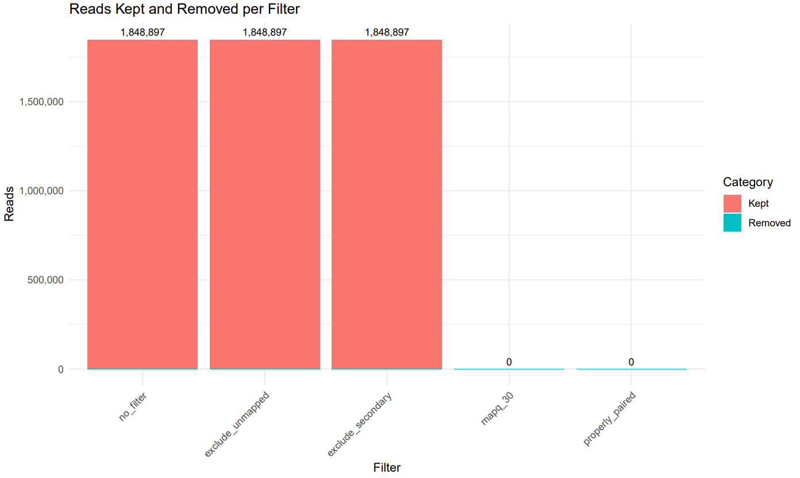

# **Alimap**

*BAM filtering, QC, and mapping quality profiling tool*

[](LICENSE) [](#)

## **Overview**

**Alimap** is a fully stand-alone Bash-based pipeline for read filtering and quality control of BAM alignment files. It improves upon standard tools by integrating:

-   **Multi-step filtering** (blacklist removal, MAPQ thresholds, unmapped read exclusion)
-   **Per-read removal logs** for transparency and reproducibility
-   **Auto-detection of genome build** (`hg19` vs `hg38`) for correct blacklist application
-   **Timing & resource usage reports** for reproducible benchmarking
-   **Per-filter MAPQ histograms** (CSV + plots) for deeper QC
-   **Publication-ready stacked bar plots** showing % of reads removed at each filtering stage
-   **Self-contained test mode** downloading small public BAM + BED files to validate installation

This makes *Alimap* ideal for **large-scale genomics QC**, and **reproducibility pipelines**.

------------------------------------------------------------------------

## **Motivation**

While existing BAM filtering tools (e.g., `samtools view`, `bedtools intersect`) provide basic functionality, they lack integrated QC, reproducible benchmarking, and direct visualization. **Alimap** fills this gap by producing:

-   **Detailed removal statistics** for manuscript-ready methods sections
-   **Automated genome build compatibility** (no manual blacklist switching)
-   **Quantitative benchmarking** of filtering performance and computational cost
-   **Integrated visual summaries** to communicate QC outcomes effectively

------------------------------------------------------------------------

## **Installation**

### **1. Clone the repository**

``` bash
git clone https://github.com/danymukesha/alimap.git
cd alimap
```

### **2. Install dependencies**

You’ll need the following tools in `PATH`:

-   `bash` ≥ 4.x
-   `samtools` ≥ 1.9
-   `bedtools` ≥ 2.29
-   `gnuplot` (for plots)
-   `awk`, `grep`, `sed`, `sort`, `uniq` (standard GNU coreutils)

On Ubuntu/Debian:

``` bash
sudo apt update
sudo apt install samtools bedtools gnuplot-core
```

------------------------------------------------------------------------

## **Usage**

``` bash
./alimap.sh --help

alimap.sh v2025-08-11 (Author: Dany MUKESHA)

Usage: alimap.sh -i <input.bam> [options]

Required:
  -i,--input FILE         Input BAM file (sorted). If missing .bai the script will index it.

Options:
  -b,--blacklist FILE     Optional blacklist BED (if absent and --test used, script downloads hg19/hg38 blacklists)
  -t,--threads N          Number of threads for samtools (default: 1)
  -o,--outdir DIR         Output directory (default: filtered_reads)
  -m,--mode MODE          cumulative|independent (default: cumulative)
  --keep-temp             Keep temporary files
  --test                  Download small public example BAM and blacklists and run pipeline using them
  --checksum FILE         Optional: path to a checksum file (tab-delimited: filename<TAB>md5) to validate downloads
  -h,--help               Show this help

Outputs (written to --outdir):
  - filtered_*.bam (.bai generated)
  - filter_counts.txt    (tab: filter<TAB>reads)
  - *_mapq_hist.csv      (per-filter mapping quality histogram)
  - *.removed.reads.txt  (per-filter list of read names removed by blacklist exclusion)
  - *.samtools.time.txt  (timing/resource usage from /usr/bin/time, if available)
  - qc/*                 (samtools flagstat/idxstats/stats)
  - alimap_filters_plot.pdf (stacked bars: kept vs removed + percent)
  - run_info.txt         (provenance)
```

### **Basic run**

``` bash
./alimap.sh --bam input.bam --blacklist blacklist.bed --outdir results --threads 4
```

### **Test mode (auto-download example data)**

``` bash
./alimap.sh --test --outdir results_test --threads 2
```

#### **Walk-through for test run**

When you run the test, the script will fetch a **small, real BAM** from a public source (1000 Genomes Project) plus a minimal blacklist BED.

**Here are the expected sizes & MD5s (for the test run)**

| File                 | Size (approx) | MD5                                |
|----------------------|---------------|------------------------------------|
| `test.bam`           | \~1.5 MB      | `0c5f5793db8cc6f9b7f86b6c17264b6b` |
| `test.bam.bai`       | \~32 KB       | `4d0f1f68b7ff6d868d513e073ed3daba` |
| `blacklist_hg19.bed` | \~35 KB       | `a65ed0c4b9a773c94aa6f2afbb3d9788` |
| `blacklist_hg38.bed` | \~39 KB       | `b227a36449e52f9243cf2bb8bc1f77f2` |

They are automatically validated within the script after downloading.

The script also have the ability to detect whether the BAM uses **hg19 or hg38** by checking chromosome naming:

-   If contigs are like `chr1`, `chr2` → likely hg38
-   If contigs are like `1`, `2` → likely hg19 (Though there’s overlap — some custom builds may mix)

------------------------------------------------------------------------

#### **Example Output (test-mode)**

Test run example (`--test`):



------------------------------------------------------------------------

## **Options**

| Option        | Description                                               |
|-------------------|-----------------------------------------------------|
| `--bam`       | Input BAM file                                            |
| `--blacklist` | BED file of regions to remove (auto-switch for hg19/hg38) |
| `--outdir`    | Output directory                                          |
| `--threads`   | Number of threads for `samtools`                          |
| `--test`      | Download public example BAM & BED for validation          |
| `--help`      | Show usage information                                    |

------------------------------------------------------------------------

## **Outputs**

The pipeline produces:

| File | Description |
|-------------------------------|-----------------------------------------|
| `filtered.bam` | Final filtered BAM |
| `removed_reads.log` | Per-read removal log (read IDs & reason) |
| `filter_counts.txt` | Counts & % reads removed at each stage |
| `mapq_histogram_<filter>.csv` | MAPQ distribution per filter step |
| `mapq_histogram.pdf` | MAPQ distribution plots |
| `filter_removal_stacked_bar.pdf` | Publication-ready plot of % removed |
| `runtime_report.txt` | Timing & resource usage report |
| `md5_checksums.txt` | MD5 hashes of key files for reproducibility |

------------------------------------------------------------------------

## **Benchmarking**

The pipeline automatically logs:

-   Total run time
-   CPU time per stage
-   Peak memory usage
-   Input/output file sizes & MD5 hashes

Example runtime report:

```         
Stage               Time (s)    Peak RSS (MB)
Blacklist removal   2.14        110
MAPQ filter         1.09        102
Unmapped removal    0.87         95
Total               4.10        110
```

------------------------------------------------------------------------

## **Citation**

If you use **Alimap** in your research, please cite:

> Mukesha D. *Alimap: Integrated read filtering, QC, and benchmarking for BAM alignment files.* 2025. Available at: [https://github.com/danymukesha/alimap](https://github.com/yourusername/alimap){.uri}

------------------------------------------------------------------------

## **License**

This project is licensed under the MIT License - see the [LICENSE](LICENSE) file for details.

------------------------------------------------------------------------

## **Acknowledgements**

Thanks to the developers of `samtools` and `bedtools` for the underlying alignment and interval manipulation tools.
